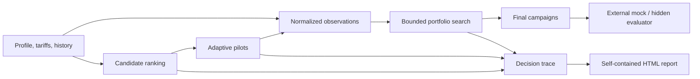

# Adaptive Campaign Portfolio Agent

Агент помогает маркетинговому аналитику выбрать до 10 кампаний перехода между
тарифами. Цель — максимизировать **чистый прирост ARPU**: ожидаемый прирост
выручки минус стоимость контактов, не нарушая общий бюджет, лимит охвата и уже
потраченные на пилоты ресурсы.

Все данные кейса синтетические. Результаты локального mock-оценивания нельзя
интерпретировать как прогноз для реального оператора или скрытого судейского
набора.

## Быстрый запуск

Папка starter kit содержит пробел в конце имени, поэтому путь нужен в кавычках:

```bash
cd "beeline_case_participants "
python -m pytest tests/test_portfolio_optimizer.py tests/test_reporting.py -q
python local_eval.py
python local_eval.py --runs 10
python make_submission.py
```

HTML-отчёт строится только из уже сохранённого trace и не запускает агента:

```bash
python -m reporting \
  --input ../reports/decision_trace.json \
  --output ../reports/demo.html
```

Для команды выше каталог `reports` находится уровнем выше starter kit.
Файл `reports/decision_trace.json` должен быть создан интеграционным или
benchmark-запуском; репортёр его не генерирует.

Проверено локально на Python 3.12.2, pandas 2.2.2, NumPy 1.26.4 и pytest 7.4.4.
Проект не требует web-фреймворка, CDN или optimization-библиотеки.

## Состав решения

- `candidate_engine.py` — исторические гипотезы и ранжирование кандидатов;
- `agent.py` — текущая координация пилотов и финальных кампаний;
- `portfolio_optimizer.py` — независимый финальный portfolio builder с bounded
  beam search, готовый для вызова из координатора;
- `reporting.py` — self-contained HTML из сохранённого decision trace;
- `environment.py`, `scoring_core.py` — публичные интерфейс и механика кейса;
- `data/`, `customer_profile.csv`, `tariff_dictionary.csv` — входные данные;
- `local_eval.py` — mock-оценка, `make_submission.py` — генерация submission;
- `tests/` — независимые синтетические тесты оптимизатора и отчёта;
- `docs/ARCHITECTURE.md`, `docs/DEMO.md` — архитектура и сценарий демонстрации.

`portfolio_optimizer.py` не импортирует командные модули и не изменяет `env`.
Его публичный контракт:

```python
build_campaigns(env, observations, config=None, trace=None) -> list[dict]
```

## Как принимается решение

1. История формирует prior для ранжирования, но не выдаётся за причинный эффект.
2. Пилоты измеряют эффект на текущей аудитории. Среднее, стандартная ошибка и
   conservative lift хранятся в единицах канала с множителем `1.0`.
3. Оптимизатор заново строит фактическую аудиторию по текущему тарифу и ARPU-
   сегменту, сортирует числовой `ID_NUMBER` и берёт первые 5000 строк — так же,
   как публичный scorer.
4. Для push, SMS и digital ads эффект умножается на channel multiplier ровно
   один раз. Из conservative gross вычитается полная стоимость контактов.
5. Для каждой audience cell доступны альтернативы target/channel и `skip`.
   Bounded beam search совместно учитывает бюджет, остаток контактов, максимум
   10 кампаний и правило «одна финальная кампания на cell».
6. Если ни одна обычная альтернатива не имеет положительного conservative net,
   используется явно помеченный emergency fallback. Он не называется
   безрисковым; при отсутствии выполнимой аудитории возвращается пустой список с
   событием infeasible fallback.

Поиск — ограниченная детерминированная эвристика, а не доказанно глобальный
оптимум. Greedy portfolio считается как baseline incumbent, и beam-результат не
возвращается, если он хуже по той же proxy-цели.

## Ограничения ресурсов

- до 10 финальных кампаний;
- до 5000 контактов в одной кампании;
- до 15 000 контактов и 100 000 у.е. суммарно, включая пилоты;
- планирование начинается с `env.remaining_budget` и
  `env.remaining_contacts`, поэтому расходы пилотов уже учтены;
- пересечение пилотных и финальных аудиторий возможно, но реальные pilot IDs
  планировщику неизвестны. Final-only gross — консервативный proxy и не
  складывается с `observed_lift_total` пилотов.

## Архитектура



## Воспроизводимость и benchmark

Submission создаётся командой `python make_submission.py`. Перед сдачей нужно
зафиксировать версии окружения, выполнить тесты, один локальный прогон и
`python local_eval.py --runs 10`. Сводка 10 seed должна появиться в
`reports/benchmark.md`; сейчас benchmark для интегрированной версии **pending**,
поэтому численные результаты здесь намеренно не заявлены.

## Ограничения метода

- история и текущая аудитория относятся к разным популяциям;
- история содержит только людей, уже сменивших тариф, и подвержена selection bias;
- before/after lift не является причинной оценкой эффекта кампании;
- uncertainty band и bounded search — эвристики после адаптивного отбора;
- mock effects отличаются от hidden effects;
- точное пересечение пилотов и финальных аудиторий неизвестно;
- текущий `agent.py` должен быть интеграционно переведён на общий контракт
  observations → `build_campaigns` капитаном, поскольку этот модуль не входит в
  зону владения portfolio-задачи.

## Путь в production

Нужны рандомизированные контрольные группы, логирование treatment propensity,
калибровка эффекта каналов, мониторинг drift и качества uncertainty, а также
ручное approval перед публикацией в campaign platform. После появления этих
контуров Analyst Copilot может объяснять альтернативы, но не заменять
контролируемую оценку эффекта.
