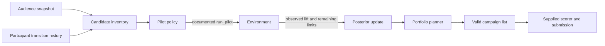

# Architecture and decision record

## Product hypothesis

**Pilot to Portfolio** is a marketing decision service for a human analyst. It converts a monthly audience snapshot into a list of at most ten tariff campaigns. It spends a small portion of the common contact and money budget on pilots, learns from their noisy outcomes, then chooses a portfolio with measured expected incremental ARPU. The useful innovation is an explicit **exploration to allocation loop**: an experiment has value only when its result can change a later budget decision.

The competition case is synthetic. The following production architecture is a proposal based on common data platform, experimentation, and campaign activation patterns used at scale. We do not claim that Beeline uses this exact architecture.

The direction is grounded in public evidence: [Beeline Kazakhstan describes segmented audiences, SMS and push, and consent based messaging](https://old.beeline.kz/ru/events/news/beeline-%D0%BD%D1%8B%D2%A3-%D0%B6%D0%B0%D2%A3%D0%B0-big-data-%D1%81%D0%B5%D1%80%D0%B2%D0%B8%D1%81%D1%96-%D0%B6%D0%B0%D1%80%D0%BD%D0%B0%D0%BC%D0%B0%D0%BD%D1%8B%D2%A3-%D1%82%D0%B8%D1%96%D0%BC%D0%B4%D1%96%D0%BB%D1%96%D0%B3%D1%96%D0%BD-%D0%B0%D1%80%D1%82%D1%82%D1%8B%D1%80%D0%B0%D0%B4%D1%8B.html?region=kzt). [VEON's 2024 annual report](https://www.veon.com/fileadmin/user_upload/investors/reports/2025/VEON_IAR_2024.pdf) describes next best offer and recommendation models at Beeline Kazakhstan and MLOps on Kubernetes. Those sources support the building blocks; the specific service boundaries below remain our proposal.

## Hackathon flow: implemented now

1. **Candidate inventory.** Group the current audience by tariff and ARPU segment. Estimate cell size and mean predicted ARPU. Score historical transitions by clipped mean percentage ARPU change and a smoothed transition share. An unseen tariff pair gets a small price based hint. History is only a prior because the scoring population is different.
2. **Exploration.** Pilot up to fourteen different hypotheses on SMS, typically 100 customers each. Explore distinct cells before a second target in one cell. Recheck up to six promising hypotheses with up to 200 additional customers. Pilots are actual paid contacts; the documented API tracks their costs and reach. A public noise scale (0.804 per customer) gives an uncertainty estimate of `0.804 / sqrt(prior_weight + pilot_contacts)`.
3. **Posterior update.** Combine the historical weak prior (equivalent to 12 observations) with actual pilot ratios, weighted by their sample counts. This is an approximate normal update, not a claim of calibrated causal inference. A conservative lift estimate subtracts 0.75 standard deviations from the mean.
4. **Portfolio allocation.** Keep one target per disjoint `(current_tariff, arpu_segment)` cell. Add positive conservative opportunities as free push campaigns, subject to campaign count and remaining contact limits. Upgrade selected cells to SMS, digital ads, or call when conservative extra ARPU exceeds extra contact cost and the remaining budget can pay for it. Every final campaign uses an existing tariff and channel.

The agent reads only `env.customer_profile`, `env.tariffs`, `env.channels`, public limit counters, and `env.run_pilot`; it also reads the supplied participant history in `data/change_tariff.csv`. It does not inspect hidden environment state or import the mock effect model. It runs without an LLM or network access, so a model outage cannot block scoring.

## Proposed production shape

```mermaid
flowchart LR
  S[Consented customer and usage events] --> F[Governed feature pipeline]
  F --> FS[Versioned monthly feature snapshot]
  FS --> G[Eligibility and consent gate]
  G --> R[Candidate and causal uplift models]
  R --> X[Experiment assignment and outcome logging]
  X --> B[Budget and contact policy optimizer]
  B --> A[Analyst review and approval]
  A --> O[Campaign orchestration platform]
  O --> L[Exposure and outcome log]
  L --> F
```

The production extension would use batch feature snapshots, a model registry, randomized holdouts, logged assignment propensities, delayed outcome measurement, and a constrained optimizer. The **analyst approval gate** allows review before activation. A separate policy layer would enforce opt in, suppression lists, frequency caps, per channel budgets, tariff eligibility, and fairness checks. Every decision would store feature and model versions, pilot evidence, chosen channel, expected effect, and reason codes so an analyst can audit or roll it back. Raw identifiers would stay inside a governed environment; downstream dashboards would use aggregate metrics.

This is a proposed roadmap, not functionality already shipped in this repository. The hackathon interface has no consent, holdout, or activation APIs, so the current agent does not pretend to enforce them. A future LLM could explain candidate tradeoffs to analysts or generate hypotheses, while the numeric policy and validation continue to make the final constrained decision.

## Why this design fits the case

| Constraint | Design response |
|---|---|
| Hidden target effects differ from history | Historical priors are weak; pilots update the estimate |
| Noisy pilots and shared budget | Sample size weights confidence; pilots stop at the documented cap |
| Up to 10 final campaigns, 5,000 people each | Disjoint cell selection and explicit count guard |
| 15,000 contacts and 100,000 units including pilots | Final planner starts from `env.remaining_contacts` and `env.remaining_budget` |
| Duplicate contacts do not double revenue | One final target per tariff and ARPU cell |
| Four channels with very different costs | Incremental channel upgrade calculation |
| Reproducible submission and ten minute limit | Deterministic local logic, no runtime API calls |

## Known limits and next experiments

The current estimate assumes a channel's lift scales roughly with its published conversion multiplier; conversion clipping can make this optimistic for high response rates. The approximate normal uncertainty model uses the brief's public noise scale and does not account for systematic bias between historical and target audiences. An improved version should add cross cell hierarchical pooling, prospective holdouts, and a stronger optimizer for partial cell allocation. The mock scorer is useful for correctness and stress tests, but its effects must never be treated as the hidden judging truth.
